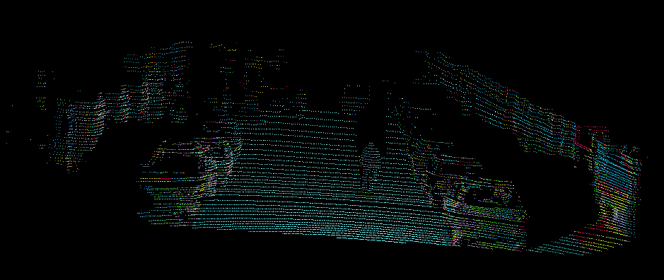
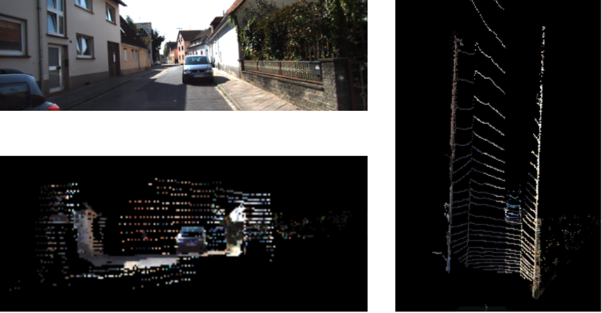

## About
This code is to porject the LiDAR point cloud to the image & generate the point cloud with color



## Input
* Images (.png files)
* Point cloud files (.bin files)
* Calib files
    Support two kinds of calib files' type.
    * All parameters stored in one file. e.g. KITTI
        > * R_rect: shape 3*3
        > * P_rect: shape 3*4
        > * Tr: shape 3*4 
    * The parameters are stored in two files. One is for the camera, the other is for LiDAR2Cam. e.g. KITTI raw
        > * R_rect: shape 3*3
        > * P_rect: shape 3*4

        > * R: shape 3*3
        > * T: shape 3*1

## Steps
* Put all the images into [img](./img/), and put all the point cloud files into [lidar](./lidar/)(**Notice: The filename of the image and the corresponding point cloud file should be the same.**). Put the calib file into [calib](./calib/)

* Set the parameters in [main.py](./main.py).
    * CALIB_TYPE: 0:All parameters in one file; 1:Parameters are stored in two files
        > If CALIB_TYPE == 0:
        >    * CALIB: Path of the calib file

        > If CALIB_TYPE == 1:
        >    * CAM2CAM: Path of the calib file for camera
        >    * LIDAR2CAM: Path of the calib file for LiDAR2Cam
    * IMG_PATH: The path of images
    * LIDAR_PATH: The path of point cloud files
    * SIMG_PATH: The path to stored the result images
    * SPC_PATH: The path to stored the result point cloud with color
    * SBEV_PATH: The path to stored the result BEV
    * SFV_PATH: The path to stored the result FV
    * CAM_ID: The NO. of the camera.
        > For the multi-camera sensor system like KITTI, you need to set it to the ID of the camera. For the system which only has one camera, it is set to be 0.

* Run [main.py](./main.py) to get the result.
    ```Bash
    python main.py
    ```

## Visualization
### Image
The result image is saved in the path you set

### Point cloud with color
* Go to the path you set to save the result .pcd files
* Use Open3d 0.7.0.0 to show the point cloud
    ```Bash
    python pcd_vis.py
    ```


### BEV & FV
The BEV & FV is saved in the path you set




